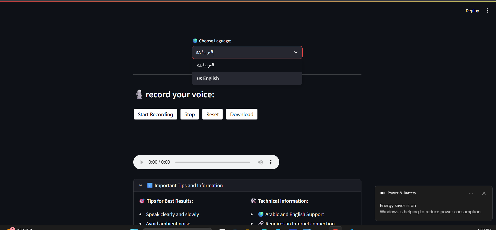

<p align="center">
   
</p>   

# 🎤 Speech-to-Text Streamlit Application

This Streamlit application provides a user-friendly interface for converting spoken language into text. It supports both Arabic and English, offering a seamless experience for real-time transcription.

## ✨ Features

* **🎙️ Voice Recording:** Record your voice directly within the app.
* **🌍 Language Selection:** Choose between Arabic (ar-SA) and English (en-US) for transcription.
* **🔄 Real-time Transcription:** Convert recorded speech into text with a single click.
* **📝 Text Display & Copy:** View the transcribed text and easily copy it to your clipboard.
* **✅ Robust Error Handling:** Get clear feedback on transcription success or any issues encountered.
* **ℹ️ Helpful Guidance:** Access tips for optimal recording quality and technical details about the app.
* **🎨 Custom Styling:** Enjoy an intuitive and visually appealing interface.

## 🚀 How It Works

The application leverages the `speech_recognition` library to interact with Google's Web Speech API for accurate transcriptions. Audio is captured using the `st_audiorec` component, temporarily saved, processed, and then deleted to ensure user privacy.

## 📈 Future Developments

We're always looking to enhance this application. Here are some potential future features:

* **Voice Recognition (Speaker Identification):** Implement functionality to not only transcribe speech but also identify the speaker.
* **Voice Translation:** Add the capability to translate the transcribed text into various languages.

## 💻 Setup and Running

To get this application running on your local machine, follow these steps:

### Prerequisites

* Python 3.7+
* `pip` (Python package installer)

### Installation

1.  **Create a Virtual Environment:**
    It's recommended to use a virtual environment to manage dependencies.
    ```bash
    python -m venv venv
    ```

2.  **Activate the Virtual Environment:**
    * **Windows:**
        ```bash
        .\venv\Scripts\activate
        ```
    * **macOS/Linux:**
        ```bash
        source venv/bin/activate
        ```

3.  **Install Dependencies:**
    Install the required Python packages. You can create a `requirements.txt` file with the following content:
    ```
    streamlit
    speechrecognition
    st-audiorec
    ```
    Then, install:
    ```bash
    pip install -r requirements.txt
    ```
    

4.  **Save the Code:**
    Save the provided application code (from the `app.py` in the documentation) into a file named `app.py` in your project directory.

5.  **Run the Application:**
    With your virtual environment activated, run the Streamlit app:
    ```bash
    streamlit run app.py
    ```
    This will open the application in your default web browser.

## 🛑 Important Notes

* An active **internet connection** is required for the speech recognition service.
* Your **privacy is paramount**: audio recordings are processed temporarily and **not saved** by the application.
* You will need to grant your browser **microphone access** when prompted.
